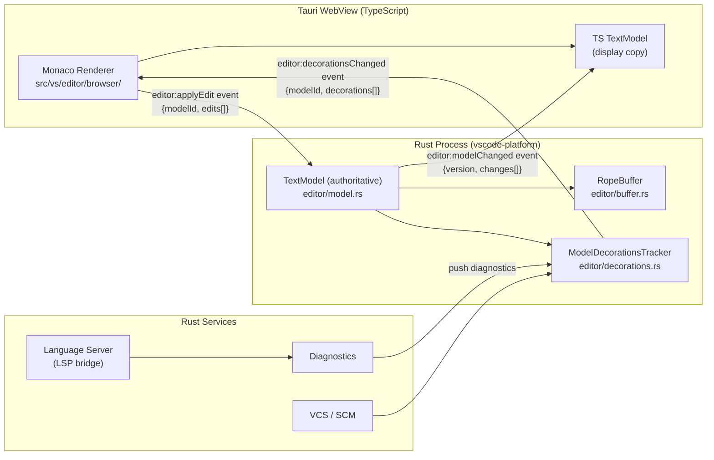

# Monaco Editor Integration: Tauri WebView + Rust TextModel Authority

## Overview

Monaco editor renderer (`src/vs/editor/browser/`, ~1000 TS files) runs inside the Tauri
WebView unchanged. Server-side Rust holds authoritative `TextModel` state. The two sides
stay in sync via Tauri events.

Decision rationale: see `tauri/docs/adr/0001-monaco-renderer.md`.

---

## Architecture Diagram



---

## Sync Protocol

### Renderer → Rust (edit operations)

When the user types or pastes, Monaco fires a `contentChanged` event. A thin TS shim
(`vscode-platform-bridge.ts`, to be authored) translates this to a Tauri event:

```
event name : "editor:applyEdit"
payload    : { modelId: string, version: number, edits: TextEdit[] }
```

Rust handler in `vscode-platform` calls `TextModel::apply_edits(edits)`, bumps the
version, and emits a confirmation event.

### Rust → Renderer (model changed confirmation)

```
event name : "editor:modelChanged"
payload    : { modelId: string, version: number, changes: TextEdit[] }
```

The TS shim verifies `version` monotonicity. Version mismatch triggers a full resync
(`editor:requestSnapshot` / `editor:snapshot`).

### Rust → Renderer (decorations and diagnostics)

Language servers, VCS, and diagnostics pipelines update `ModelDecorationsTracker` in Rust.
After any mutation the tracker emits:

```
event name : "editor:decorationsChanged"
payload    : { modelId: string, decorations: Decoration[] }
```

The TS shim calls `editor.deltaDecorations()` on the Monaco model.

---

## Performance Budget

| Operation | Target (p99) |
|---|---|
| Keystroke → Rust edit applied | < 4 ms |
| Rust event → Monaco deltaDecorations | < 8 ms |
| Full round-trip (type → decoration visible) | < 16 ms |

Tauri IPC serialisation overhead is ~0.5–1 ms per call on Apple Silicon (measured in
existing `cli/` sidecar usage). JSON payloads for single-character edits are < 200 bytes.
The 16 ms p99 target preserves a 60 fps frame budget.

---

## Open Questions

1. **Conflict resolution**: If network or extension-host edits arrive concurrently with
   user edits, the version-bump scheme may diverge. An operational-transform or CRDT layer
   is not yet designed.

2. **Large file performance**: `RopeBuffer` (ropey crate) handles multi-MB files well, but
   the JSON serialisation of `TextEdit[]` for large pastes needs batching or a binary
   codec (e.g., MessagePack).

3. **Undo/redo stack**: `src/vs/editor/common/model/editStack.ts` owns the undo stack in
   TS today. Authority must migrate to Rust to keep versions consistent. Deferred.

4. **Multi-cursor edits**: Multiple simultaneous `TextEdit` entries in one `applyEdit`
   call must be applied in reverse order (bottom-up) to preserve offsets. Current stub
   applies in order — correct only for non-overlapping ranges.

5. **Binary / notebook cell buffers**: `RopeBuffer` is UTF-8 rope. Binary blobs (images
   in notebooks) need a separate buffer type. Out of scope for this stub.
